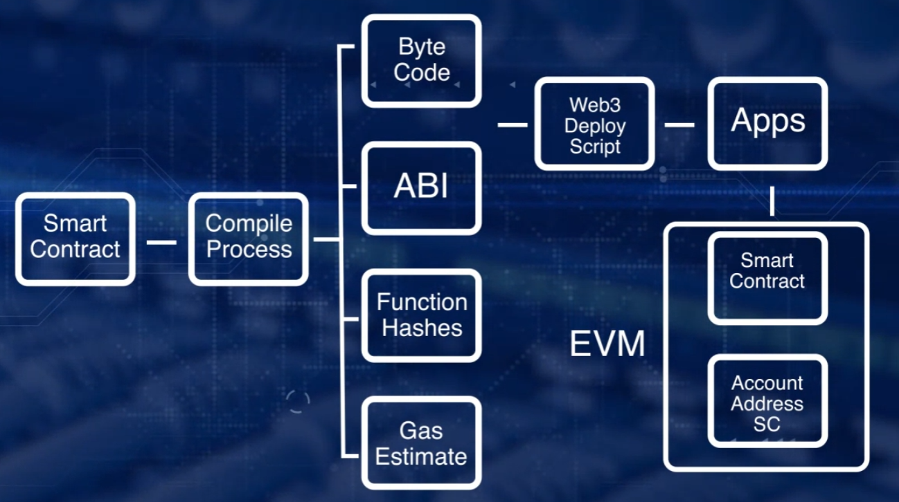

- [Basics: Why Smart Contracts?](#basics-why-smart-contracts)
  - [Smart Contracts Defined](#smart-contracts-defined)
    - [Elements of smart contract](#elements-of-smart-contract)
    - [Three steps in development of smart contract](#three-steps-in-development-of-smart-contract)
  - [Processing Smart Contracts](#processing-smart-contracts)
    - [Address](#address)
    - [Compile artifacts](#compile-artifacts)
  - [Deploying Smart Contracts](#deploying-smart-contracts)

# Basics: Why Smart Contracts?

`Smart contract`

+ centerpiece and main thrust of Ethereum blockchain
+ improper design and coding of smart contract result in significant failures such as DAO hack and Parity wallet lockup
+ many variations of smart contracts are prevalent in blockchain context
  + Bitcoin has script feature includes rules & policies
    + simple(limited) conditional transfer of value through an embedded script
    + Linux Foundation's Hyperledger blockchain has smart contract feature 'Chaincde', written in Go, and executed in Docker(lightweight container technology for executing programs) environment
+ Ethereum is working smart contract layer supports any arbitrary code execution over blockchain
+ addresses need for an application specific validation for blockchain applications
+ facilitates transaction for transfer of assets other than value or cryptocurrency
+ allows specification of rules for operation on blockchain
+ facilitates implementation of policies for transfer of assets in decentralized netwokr
+ add programmability and intelligence to blockchain
+ represents business login layer with actual logic coded in special high level language
+ embeds function that can be invoked by messages like function calls
  + messages/input parameters for a message are specified in transaction
+ provieds a layer of computation logic that can be executed on blockchain, thus availing feature enabled by blockchain framework
+ Ethereum Stack
  + Verticals: End User Applications
  + Application Framework: Smart Contracts
  + Ethereum Blockchain and Ethereum Virtual Machine(EVM)
  + Peer-to-Peer Network and Operating Systems
  + Hardware

**Bitcoin transaction vs Smart contract transaction**

+ Bitcoin transaction
  + all transactions are about SendValue
+ Blockchain supports smart contract
  + transaction could embed function implemented by smart contract
  + Ex. Voting smart contract: ValidateVoter, Vote, Count, DeclareWinner

**Existing system vs Smart contract**

+ Smart contract
  + all operations are transaprent and are recorded on blockchain
  + customers can access tools without intermediary (like a bank)

**Problems smart contract can solve**

+ business transaction may involve rules, policies, laws, regulations, governing contexts
+ smart contract allows real world constraints to be realized on blockchain, enables decentralized application of arbitrary complexity to be implemented on blockchain
+ run spectrum from supply chains to disaster recovery
+ allows implementation of rules, policies, methods for governance and provenance

`Remix IDE` : web interface for deploying & running transactions in blockchain

## Smart Contracts Defined

+ smart contract stores variables in state variables, and we can retrieve how variables change over blocks

### Elements of smart contract

+ pragma directive
+ name of contract
+ data/state variable define state of contract
+ collection of function to carry out intent of smart contract
+ identifiers representing thesse elements are erstricted to ASCII character set
+ follow camel case convention

### Three steps in development of smart contract

1. Design
```
- uint storedData
- set (uint)
- get () : returns uint
- increment (uint n)
- decrement (uint n)
```
2. Code
```sol
pragma solidity ^0.4.0;

contract SimpleStorage {
    uint storedData;

    function set(uint x) public {
        storedData = x;
    }

    function get() constant public returns (uint) {
        return storedData;
    }

    function increment (uint n) public {
        storedData = storedData + n;
        return;
    }

    function decrement (uint n) public {
        storedData = storedData - n;
        return;
    }
}
```
3. Test

## Processing Smart Contracts

### Address

: computed by hashing account number of externally owned account UI and nonce

### Compile artifacts

+ Name of contract
+ Contract Bytecode for deploying: bytecode executed for instantiating smart contract on EVM
+ Application Binary Interface(ABI) for application that smart contract interact with deployed bytecode
+ Web3 Deploy module: provides script code for invoking smart contract form web application
  + json script to web application to invoke smart contract function
  + script for programmatically deploying smart contract from web application
+ Gas estimates: provides gas estimates for deploying smart contract and for the function invocation
+ Function hashes: first 4 bytes of function signatures to facilitate function invocation by transaction
+ Instance BytecoInstance Bytecode: bytecode of smart contract instance

## Deploying Smart Contracts



1. contract address is generated by hasing  sender's account address and its nonce
  + target account 0 or null: reserved for smart contract creation and deployment, meaning creating new smart contract using its payload fees
    + payload of transaction contains bytecode for smart contract
    + this code is executed as part of transaction execution to instantiate bytecode for actual smart contract
2. execute smart contract creation transaction &rarr; results in deployment of smart contract code on EVM, permanently stored in EVM for future invocation
     + this transaction goes through all regular verification/validation specified in Ethereum blockchain protocol
3. block creation and transaction confirmation by full nodes(a program that fully validates transactions and blocks) &rarr; deploys same contract on all nodes, providing consistent execution when regular transaction with function messages are invoked on smart contract

+ other approaches for deploying smart contract
  + deployed from Remix IDE, another smart contract, CLI, another high-level language application, web applicaton, ...