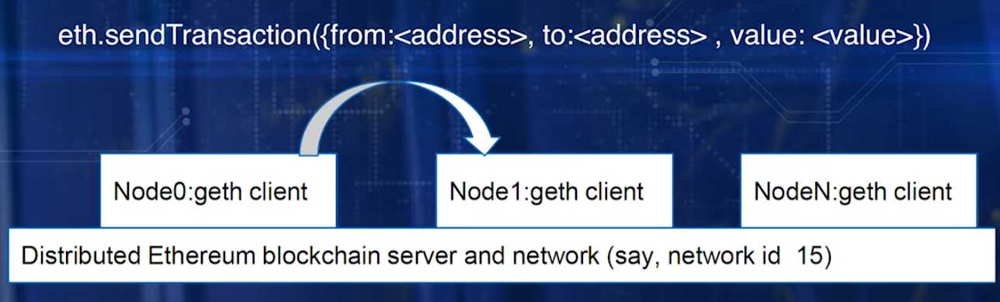
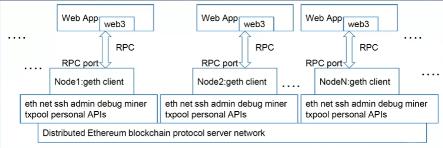

- [Dapps](#dapps)
  - [Blockchain Server](#blockchain-server)
    - [Dapps Stack](#dapps-stack)
    - [Install Ethereum services and API](#install-ethereum-services-and-api)
    - [Create first node](#create-first-node)
    - [Create node and add it as peer node](#create-node-and-add-it-as-peer-node)
  - [Dapp Architecture](#dapp-architecture)
  - [Ethereum APIs](#ethereum-apis)
- [Truffle Development](#truffle-development)
  - [Truffle IDE](#truffle-ide)
    - [truffle init](#truffle-init)
    - [truffle compile](#truffle-compile)
    - [truffle develop](#truffle-develop)
    - [truffle migrate](#truffle-migrate)
  - [Test-Driven Development](#test-driven-development)
    - [truffle test](#truffle-test)
  - [Web Interface & Testing](#web-interface--testing)
- [Design Improvements](#design-improvements)
  - [Solidity Featuers](#solidity-featuers)
  - [Event Handling](#event-handling)
  - [Oraclize](#oraclize)
- [Application Models & Standards](#application-models--standards)
  - [Dapp Models](#dapp-models)
  - [Dapp Standards](#dapp-standards)

# Dapps

: Decentralized Applications

+ Solves problem requires blockchain services and blockchain infrastructure for realizing its purpose
+ Provides blockchain features and services to the outside world for review, interactions and enjoyment
+ Gives access to blockchain for people and applications and systems, not necessarily known to each other to transact peer-to-peer
+ End=to-end application development process
+ Depends on functionality of blockchain for its infrastructure and opeartions
+ Simplest form: client interface as front-end & back-end that includes blockchain and smart contracts
  + Client: web app, HTML, JavaScript framework, CLI, desktop app, moblie app, IoT, ...
  + Web front-end is outside blockchain; can only link into blockchain smart contract using artifacts generated by smart contract
  + Dapp can be created with non-blockchian back-end(Ex. IPFS(Interplanetary file system))

**Truffle IDE**

## Blockchain Server

+ provides access to
infrastructure hardware and blockchain services
+ differentiate blockchain

### Dapps Stack

+ Verticals: End User Applications
+ Application Framework: Smart Contracts
+ Ethereum Blockchain and Ethereum Virtual Machine
+ Peer-to-Peer Network and Operating Systems
+ Hardware

### Install Ethereum services and API

+ enables node creation, application development, transactions on blockchain

```
sudo apt-get install software-properties-common
sudo add-apt-repository -y ppa:ethereum/ethereum
sudo apt-get update
sudo apt-get install ethereum
```

&rarr; `Ethereum blockchain protocol services: Blockchain Server`

### Create first node

: initialize geth client "NODE"

```
geth --datadir ./ account new
geth --datadir ./ init customgenesis.json
geth --datadir ./ --maxpeers 95 --networkid 15 --port 303xx console
```

1. Use geth command, provided by Ethereum server installed in the above, to install node by creating new account number(EOA)
2. Initialize node using custom genesis block that has specification &rarr; first block of the chain
3. Specify network ID and port to have control over the node that interacts with blockchain

+ network ID = 15
  + network ID for Ethereum main network including metropolis = 1
  + Ropsten(public cross-client Ethereum testnet) = 3
  + Rinkeby = 4
  + Musicion(music blockchain) = 7762959
  + Be aware of network IDs of other public networks when deploying public blockchain
  + Be aware of other netowkr IDs in use if there are any, in private environment

&rarr; `Node 0: Bootnode:: Node, Accounts, EVM for smart contracts`

+ Enode address is used by other nodes to connect to this bootnode and establish peer-to-peer network on which the blockchain operates

### Create node and add it as peer node

```
geth --datadir ./ account new
geth --datadir ./ init customgenesis.json
geth --datadir ./ --maxpeers 95 --networkid 15 --port 303xx console
admin.addPeer("Enode address")
```

&rarr; `Node 1: Node, Accounts, EVM for smart contracts`

## Dapp Architecture

+ invokes functions on smart contract, records transaction and state transition and receipts on blockchain
+ blokcchian server is enode on underlying infrastructure, and front-end is web client with embedded web3.js script, communicating using JSON over RPC pipeline

+ Dapp with CLI
  + 
+ Dapp with web app
  + 

## Ethereum APIs

`API` : convenient and standard way to expose set of functinos related to specific dataset and services

+ expose services of blockchain server using standard functions
+ Ex. interactions with geth node on blockchian server is accomplishjed by invoking APIs
+ miner.start() : miner is API, start() is function of miner API

**APIs Ethereum provides**

1. Management APIs : support methods for management of geth node
   + Admin API
     + allows to use functions to work with eth instance, including network peer and RPC endpoint management
     + Ex. admin.addPeer(), admin.nodeInfo()
   + Debug API
     + provides ability to peek into blockchain, study it, debug any issues
     + Ex. debug.dumpBlock(16): displays block header details of block 16
   + Miner API
     + allows to control nodes mining operation and set various mining specific settings
     + Ex. miner.start(), miner.stop(), miner.start(6): 6 parallel threads are assigned to mining operation
   + Personal API
     + creation and management of accounts within node, manages private keys in key store
     + Ex. personal.newAccount(): creates new account within node
   + Txpool API
     + gives access to several non-standard RPC methods to insepct contents of tx pool containing all currently pending txs, as weel as those queued for future processing
     + Ex. txpool.inspect(): lists all pending txs to peruse and collect for building block of txs
2. Web3 APIs : support methods for development of Dapps, allows to use web3 object provided by web3.js library and all its objects, and allows to communicate with local node through RPC port
   + Ex. web3, eth(web3.eth), net(web3.net)
   + Whisper API(web3.ssh): used for secure gossiping and enables Whisper protocol
   + Web3: JS library designed for use with web client or Ethereum Dapps


1. Web request initiated by user
2. Directed to HTTP endpoint, say prot 8080 and to the web server to be executed
3. For Dapp, geth client exposes RPC endpoint using RPC port command
   1. web3 object instantiated in web page script, requests/calls invoked on the web3 object
   2. Requests are transmitted as a JSON or RPC pipeline between the web client and the geth client
   3. Requested call and function is executed using appropriate API and Smart Contract code
   4. Return to the back client

# Truffle Development

**Design Process**

1. Define data & opeartions
2. Add modifiers & validation checks
3. Perform unit testing
4. Integration testing

## Truffle IDE

: provides a range of features for Dapp development including commands for initializing a template or base directory structure for a Dapp

**Steps in Developing Dapp**

1. Create directory: initialize for various components of Dapp using "truffle init"
2. Create contracts .sol files in contracts directory. Compile using "truffle compile" debug
3. Generate test blockchain accounts using "truffle develop"
4. Deploy compiled contracts to test blockchain: "truffle migrate"
5. Add test files for testing functions of contracts w "truffle test"

**Install:**

+ Node.js
+ Truffle
+ Metamask plugin for Chrome
  + Add Metamask plugin from Metamask IO to Chrome browser
  + links to blockchain created by truffle to manage accounts, acting as a bridge between application front-end & blockchain node that hosts accounts

### truffle init

+ Contracts
  + sol contract files
+ Migrations
  + migration system to handle contract deployments
  + additional special small contrat keeps track of changes
  + js
+ Test
  + js and sol tests
+ truffle.js
  + truffle deployment configurations info
  + specify blockchain network ID, IP, RPC port

### truffle compile

+ build
  + build artifacts compiler generated
  + json file of each contract
  + network field is empty object &rarr; migration will save info 

### truffle develop

+ test chain with 10 accounts(addresses as account 0~9, 160 bits) & private keys(256 bits)

### truffle migrate

+ runs scripts in 'migrations' in turn
+ when contract code is changed and have to redeploy, set --reset flag
  + truffle migrate --reset

## Test-Driven Development

+ `Positive tests` : given valid input, smart contract perfomrs as expected
+ 'Negative tests' : for negative inputs, smart contract captures errors

### truffle test

+ test tests under 'test'
+ test files written in Solidity/JS

## Web Interface & Testing

# Design Improvements

## Solidity Featuers

## Event Handling

## Oraclize

# Application Models & Standards

## Dapp Models

## Dapp Standards