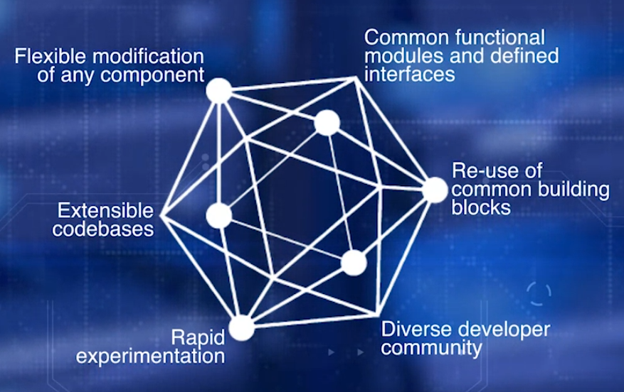
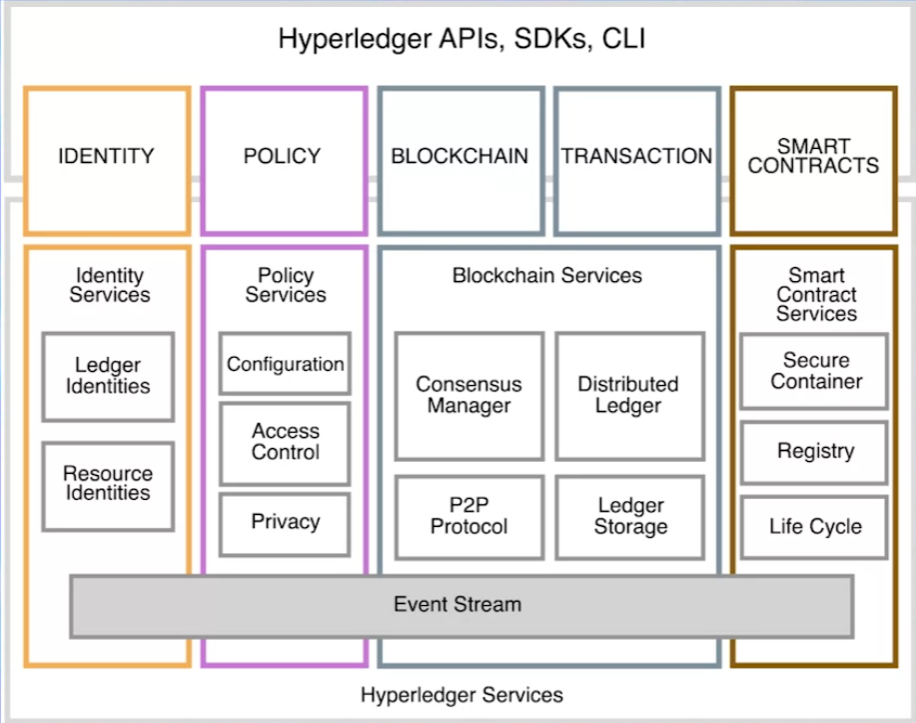

- [Permissioned Blockchains](#permissioned-blockchains)
  - [Hyperledger](#hyperledger)
  - [Fabric Services](#fabric-services)
    - [Fabric Model & Functions](#fabric-model--functions)
  - [Composer](#composer)
    - [MS Azure](#ms-azure)
- [Decentralized Applications Platforms](#decentralized-applications-platforms)
  - [Augur](#augur)
  - [Grid+](#grid)
- [Challenges & Solutions](#challenges--solutions)
  - [Consensus](#consensus)
  - [Scalability](#scalability)
  - [Privacy & Confidentiality](#privacy--confidentiality)
  - [Escrow & Multi-sig](#escrow--multi-sig)
- [Alternative Decentralized Solutions](#alternative-decentralized-solutions)
  - [IPFS(Interplanetary File System)](#ipfsinterplanetary-file-system)
  - [Hashgraph](#hashgraph)

# Permissioned Blockchains

+ nodes with permission can transact and take part in blockchain operations
+ also known as consortium blockchain based on its common use cases in specific vertical business domain such as automobile or food services consortiums

## Hyperledger

+ an ecosystem that supports not only blockchain protocol, distributed ledger, smart contract, but also framework/tools for active engagement and collaboration of developers, businesses, and other stakeholders
+ Linux Foundation's Hyperledger Fabric
  + permissioned blockchain platform
  + initiated in 2015 to promote cross industry collaborations
  + goals
    + bring together stakeholders, tech providers, developers to advance development and adoption of blockchain solutions
      + help understanding collective needs of users
      + minimize duplication of efforts in design and engineering
    + promote development of safe, reliable, efficient, innovative, quality driven open-source components and platform to support enterprise adoption of blockchain
    + 
    + Frameworks
      + Fabric, Sawtooth, Indy, Iroha, Burrow
      + Hyperledger Fabric 1.0 from IBM been into production
    + Tools
      + essential for rapid prototyping/testing
      + in incubation
      + Cello, Quilt, Composer, Explorer
+ MS Azure blockchain
  + leverages its popular Cloud offering to allow users to stand up several blockchain platforms
+ Bitcoin vs Ethereum vs Fabric
  + Bitcoin: defines transactions in terms of UTXOs
  + Ethereum: introduces smart contract, account
  + Hyperledger Fabric
    + defines whole business networks with roles, assets, aligning protocol closer to realworld application
    + no cryptocurrency
    + designed for handling only business logic, like chaincode(=smart contract functionality)
    + permissioned business blockchain
    + aims B2B, B2C
    + mining only by designated validating peers
      + helps implementation of PBFT(Practical Byzantine Fault Tolerance), consensus algorithm, vs PoW

## Fabric Services

+ design of hyperledger places emphasis on modularity and configurability, pluggable modules
  + application views its domain as being made up of many interacting blockchains of various capacities

**Services-oriented architecture representing hyperledger blockchain**

+ 4 groups of services and corresponding APIs for app to access them
  + identity services
    + manages identities of entities, participants, ledger objects, such as smart contract(chaincode)
  + policy services
    + manages access control, privacy detail, consortium rules, consensus rules
  + blockchain services
    + manages P2P communication protocol, distributed ledger maintaining global state, global state replicated at many participants, plugable consensus algorithm(PBFT or PoW)
  + smart contract services
    + provides secure/lightweight sandbox and moment for chaincode to execute
    + only full nodes call validating nodes include smart contract services
    + provides secure container equivalent to EVM, registry, lifecycle management functions
    + JVM that runs bytecode typically serves as computational environment for smart contract execution

### Fabric Model & Functions

+ modular design & permissioned participation of nodes &rarr; enable confidentiality, resilience, flexibility, scalability

**Fabric model consists of:**
  + transactions
    + confidential smart contracts enable interactions between different, independent business networks
    + transactions could be inside single network or cross network
  + peers
    + nodes that initiate transactions and maintain state of ledger
    + types
      + endorsers: endorsing peers; receive/validate & sign & return transactions to creating application
      + ordering service: ordering peers; collect signed transaction, order them into blocks and send them to committing peers
      + committing peers: receive blocks created by ordering service, validate condition such as double spending/signature, commit them to ledger
  + assets
    + represent tangible items of value that are transacted in blockchain(Ex. food supply, financial assets)
    + represented in program as key value pairs in JSON on binary format
  + chaincode
    + smart contract that defines set of assets and provides functions for operating on assets and changing states
    + implements app-specific rules and policies
  + ledger
    + function execution may result in state changes that are recorded on ledger
    + tamper proof record of state transactions
    + each transaction results in set of key-value pairs that are recorded on ledger as creates/updates/deletes
      + easily queried for later analysis and auditing
  + channels
    + defines a single permissioned network of entities with one single ledger
    + provides segregated fabric for a group of entities to transact privately
    + support multi-lateral transactions through cross-chain chaincode
  + identity
    + participating entities should have verifiable identity
    + default implementation of MSP uses a X.509 certificate as a digital identity
    + peer nodes, client apps, business entities, admins need uniform identities in Fabric
      + assigned an identity that is an X.509 certificate
    + determine the role of the entities, and the permissions they have for accessing the resources in the blockchain network
  + membership
    + MSP(Membership Service Provider): manages membership & roles of participating entities
    + root certificate authority & intermediate certificate authorities managed by the MSP
  + consensus mechanisms
    + agreement on next block of transactions to be added to chain
    + extensive validation/verification of order and correctness of transactions
    + allows pluggable consensus
      + miner of next block decided by round robin policy or PBFT(Practical Byzantine Fault Tolerant) or simple consensus

**Fabric model provides:**
  + DLT(Distributed Ledger Technology)
  + Confidentiality & Privacy(permissioned network)
  + Segregation(channels and membership services)
  + Efficiency
  + Chaincode(app-specific logic)
  + Configurability(pluggable modules)

## Composer

+ used in setting credentials, running in their server and deploying app
+ composer playgrould tool is executed to allow interacting with deployed business network

**Hyperledger tools**

+ Yeoman tool
  + used to create the skeleton Business Network
+ composer modeling
  + used to define assets of business app
  + composer tool
    + for deploying their app
+ similar to Truffle

**Steps of development**

1. Use Yeoman tool to create skeleton code for business network
   1. class definition for all assets/participants/transactions in business network in CTO file created
      1. written in Hyperledger Composer modeling language
   2. transaction functions in JS file
   3. ACL(access control file) has basic access control rules
2. After updating CTO, JS, ACL files, entire directory is packaged using composer tool, to package code into deployable business network archive

### MS Azure

+ MS developing its own platform in CoCo blockchain in cooperation with Ethereum and financial companies
+ goal is to accelerate blockchain deployment, by offering tools and development environments to rapidly deploy end-to-end solutions

**Azure blockchain as a service**

+ collection of ready to deploy ledgers
+ blockchain network with multiple nodes
+ preconfigured network configurations for developing business logic
+ tools & infrastructure in single place
+ data security & scalability of cloud platform
+ single node ledger and multi node ledger

**Azure's blockchain**

+ creates infrastructure for any blockchain
+ network architecture varies with each type of configuration
+ all network components under single resource group

**How to use Azure blockchain as platform service**

1. Choose platform(Ethereum, Corda, Hyperledger, ...)
2. Choose type of ledger(Single/multi)
3. Enter network configuration(Ex. Ethereum &rarr; num of nodes, virtual machine storage type, virtual machine size, ...)
4. Azure creates Resource group
5. Azure provides connection, maintenance, infrastructure
6. ssh into nodes to intract; all connected nodes will be synchronized
7. Can spin up additional tools for development purposes

# Decentralized Applications Platforms

## Augur

## Grid+

# Challenges & Solutions

## Consensus

## Scalability

## Privacy & Confidentiality

## Escrow & Multi-sig

# Alternative Decentralized Solutions

## IPFS(Interplanetary File System)

## Hashgraph