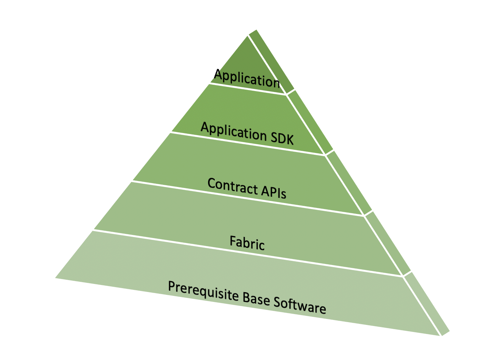

- [Permissioned Blockchains](#permissioned-blockchains)
  - [Hyperledger](#hyperledger)
  - [Fabric Services](#fabric-services)
    - [Fabric Model & Functions](#fabric-model--functions)
    - [Fabric vs Sawtooth](#fabric-vs-sawtooth)
  - [Composer](#composer)
    - [MS Azure](#ms-azure)
- [Decentralized Applications Platforms](#decentralized-applications-platforms)
  - [Augur](#augur)
  - [Grid+](#grid)
- [Challenges & Solutions](#challenges--solutions)
  - [Consensus](#consensus)
    - [Proof of Work](#proof-of-work)
    - [Proof of Stake](#proof-of-stake)
    - [Practical Byzantine Fault Tolerance](#practical-byzantine-fault-tolerance)
  - [Scalability](#scalability)
    - [Improve tx rate](#improve-tx-rate)
  - [Privacy & Confidentiality](#privacy--confidentiality)
  - [Escrow & Multi-sig](#escrow--multi-sig)
    - [Escrow](#escrow)
    - [Multi-sig](#multi-sig)
- [Alternative Decentralized Solutions](#alternative-decentralized-solutions)
  - [IPFS(Interplanetary File System)](#ipfsinterplanetary-file-system)
  - [Hashgraph](#hashgraph)

# Permissioned Blockchains

+ nodes with permission can transact and take part in blockchain operations
+ also known as consortium blockchain based on its common use cases in specific vertical business domain such as automobile or food services consortiums

## Hyperledger

+ an ecosystem that supports not only blockchain protocol, distributed ledger, smart contract, but also framework/tools for active engagement and collaboration of developers, businesses, and other stakeholders
+ Linux Foundation's Hyperledger Fabric
  + permissioned blockchain platform
  + initiated in 2015 to promote cross industry collaborations
  + goals
    + bring together stakeholders, tech providers, developers to advance development and adoption of blockchain solutions
      + help understanding collective needs of users
      + minimize duplication of efforts in design and engineering
    + promote development of safe, reliable, efficient, innovative, quality driven open-source components and platform to support enterprise adoption of blockchain
    + 
    + Frameworks
      + Fabric, Sawtooth, Indy, Iroha, Burrow
      + Hyperledger Fabric 1.0 from IBM been into production
    + Tools
      + essential for rapid prototyping/testing
      + in incubation
      + Cello, Quilt, Composer, Explorer
+ MS Azure blockchain
  + leverages its popular Cloud offering to allow users to stand up several blockchain platforms
+ Bitcoin vs Ethereum vs Fabric
  + Bitcoin: defines transactions in terms of UTXOs
  + Ethereum: introduces smart contract, account
  + Hyperledger Fabric
    + defines whole business networks with roles, assets, aligning protocol closer to realworld application
    + no cryptocurrency
    + designed for handling only business logic, like chaincode(=smart contract functionality)
    + permissioned business blockchain
    + aims B2B, B2C
    + mining only by designated validating peers
      + helps implementation of PBFT(Practical Byzantine Fault Tolerance), consensus algorithm, vs PoW

## Fabric Services

+ design of hyperledger places emphasis on modularity and configurability, pluggable modules
  + application views its domain as being made up of many interacting blockchains of various capacities

**Services-oriented architecture representing hyperledger blockchain**

+ 4 groups of services and corresponding APIs for app to access them
  + identity services
    + manages identities of entities, participants, ledger objects, such as smart contract(chaincode)
  + policy services
    + manages access control, privacy detail, consortium rules, consensus rules
  + blockchain services
    + manages P2P communication protocol, distributed ledger maintaining global state, global state replicated at many participants, plugable consensus algorithm(PBFT or PoW)
  + smart contract services
    + provides secure/lightweight sandbox and moment for chaincode to execute
    + only full nodes call validating nodes include smart contract services
    + provides secure container equivalent to EVM, registry, lifecycle management functions
    + JVM that runs bytecode typically serves as computational environment for smart contract execution

### Fabric Model & Functions

+ modular design & permissioned participation of nodes &rarr; enable confidentiality, resilience, flexibility, scalability

**Fabric model consists of:**
  + transactions
    + confidential smart contracts enable interactions between different, independent business networks
    + transactions could be inside single network or cross network
  + peers
    + nodes that initiate transactions and maintain state of ledger
    + types
      + endorsers: endorsing peers; receive/validate & sign & return transactions to creating application
      + ordering service: ordering peers; collect signed transaction, order them into blocks and send them to committing peers
      + committing peers: receive blocks created by ordering service, validate condition such as double spending/signature, commit them to ledger
  + assets
    + represent tangible items of value that are transacted in blockchain(Ex. food supply, financial assets)
    + represented in program as key value pairs in JSON on binary format
  + chaincode
    + smart contract that defines set of assets and provides functions for operating on assets and changing states
    + implements app-specific rules and policies
  + ledger
    + function execution may result in state changes that are recorded on ledger
    + tamper proof record of state transactions
    + each transaction results in set of key-value pairs that are recorded on ledger as creates/updates/deletes
      + easily queried for later analysis and auditing
  + channels
    + defines a single permissioned network of entities with one single ledger
    + provides segregated fabric for a group of entities to transact privately
    + support multi-lateral transactions through cross-chain chaincode
  + identity
    + participating entities should have verifiable identity
    + default implementation of MSP uses a X.509 certificate as a digital identity
    + peer nodes, client apps, business entities, admins need uniform identities in Fabric
      + assigned an identity that is an X.509 certificate
    + determine the role of the entities, and the permissions they have for accessing the resources in the blockchain network
  + membership
    + MSP(Membership Service Provider): manages membership & roles of participating entities
    + root certificate authority & intermediate certificate authorities managed by the MSP
  + consensus mechanisms
    + agreement on next block of transactions to be added to chain
    + extensive validation/verification of order and correctness of transactions
    + allows pluggable consensus
      + miner of next block decided by round robin policy or PBFT(Practical Byzantine Fault Tolerant) or simple consensus

**Fabric application stack**

+ 5 layers
+ Application
  + the blockchain application will utilize the Application SDKs to call smart contracts running on a Fabric network
+ Application SDK
  + (Application APIs, IDE, docs, library, code smaples, ...)
  + to develop smart contracts executed on a Fabric Network
+ Contract APIs
  + to develop smart contracts executed on a Fabric network
+ Fabric and Fabric samples
  + the Fabric executables to run a Fabric network along with sample code
+ Prerequisite Base Software (Ex. Docker)
  + the base layer needed to run the software

**Fabric model provides:**
  + DLT(Distributed Ledger Technology)
  + Confidentiality & Privacy(permissioned network)
  + Segregation(channels and membership services)
  + Efficiency
  + Chaincode(app-specific logic)
  + Configurability(pluggable modules)

[Fabric vs Sawtooth vs Composer](https://101blockchains.com/hyperledger-fabric-vs-sawtooth-vs-composer/)

### Fabric vs Sawtooth

||Fabric|Sawtooth|
|---|---|---|
Permission level|Permissioned|Permissioned and Permissionless|
Consensus algorithm|Mostly uses Kafka, supports other algorithms as well|Mostly uses Proof of Elapsed Time, supports other algorithms as well
BFT support|No, only supports Crash Fault Tolerance|Yes, supports Byzantine Fault Tolerance
Smart contract technology|Chaincode|Transaction families
Smart contract type|Installed|Installed and On-chain
Supported smart contract language|Golang or JS|Rust, JS, Go, or Python; Supports Solidity using Seth
Transaction processing|Endorsing Peers and Ordering Services|Validators
State storage|CouchDB or leveldb|Central lmdb database
EVM support|No|Yes(through seth)

## Composer

`End of life Aug 2021` : use Fabric v1.4+ instead

+ used in setting credentials, running in their server and deploying app
+ composer playgrould tool is executed to allow interacting with deployed business network

**Hyperledger tools**

+ Yeoman tool
  + used to create the skeleton Business Network
+ composer modeling
  + used to define assets of business app
  + composer tool
    + for deploying their app
+ similar to Truffle

**Steps of development**

1. Use Yeoman tool to create skeleton code for business network
   1. class definition for all assets/participants/transactions in business network in CTO file created
      1. written in Hyperledger Composer modeling language
   2. transaction functions in JS file
   3. ACL(access control file) has basic access control rules
2. After updating CTO, JS, ACL files, entire directory is packaged using composer tool, to package code into deployable business network archive

### MS Azure

+ MS developing its own platform in CoCo blockchain in cooperation with Ethereum and financial companies
+ goal is to accelerate blockchain deployment, by offering tools and development environments to rapidly deploy end-to-end solutions

**Azure blockchain as a service**

+ collection of ready to deploy ledgers
+ blockchain network with multiple nodes
+ preconfigured network configurations for developing business logic
+ tools & infrastructure in single place
+ data security & scalability of cloud platform
+ single node ledger and multi node ledger

**Azure's blockchain**

+ creates infrastructure for any blockchain
+ network architecture varies with each type of configuration
+ all network components under single resource group

**How to use Azure blockchain as platform service**

1. Choose platform(Ethereum, Corda, Hyperledger, ...)
2. Choose type of ledger(Single/multi)
3. Enter network configuration(Ex. Ethereum &rarr; num of nodes, virtual machine storage type, virtual machine size, ...)
4. Azure creates Resource group
5. Azure provides connection, maintenance, infrastructure
6. ssh into nodes to intract; all connected nodes will be synchronized
7. Can spin up additional tools for development purposes

# Decentralized Applications Platforms

+ Layers
  + Dapp platforms
  + Dapp
  + Smart contracts
  + Blockchain & EVM
  + P2P network & OS
  + Hardware
+ Why Augur/Grid+?
  + illustrate two diverse uses of blockchain
  + apps have extended history, complex components & operations
  + provenance of txs
  + address real world problems
  + offer innovative models for other domains to adapt

## Augur

+ leverages trust decentralization of blockchain and opens up prediction markets to wisdom of the crowds
+ trustless, decentralized prediction market platform based on blockchain technology
+ participants can join and leave as they wish
+ decentralized since its underlying technology is based on decentralized features of blockchain

**Key ideas**

+ end-to-end predictoin marketplace
+ trading platforms
  + allows decentralized global trading on any idea
+ crowd reporting process
+ reputation system
  + provides platform for decentralized participants to specluate on an event outcome based on their belief
+ oracle generation
  + captures wisdom of the crowd in secure Oracle that could be accessed by underlying smart contracts for resolving the outcomes
+ blockchain, smart contracts
+ robust algorithms

**Roles**

+ market creator
  + place market events
  + set expected outcomes
  + pay fees/escrows
  + establish rules
  + designate initial set of reporters
+ trador
  + place bets on expected outcomes
  + take part in prereporting phase of process
  + buy trade shares that bet on the odds of outcomes
    + trading currency = Ether
+ reporter
  + report on outcomes
  + designated reporter / open reporter (based on phase of process)

**Process**

1. Stakeholder creates marketplace
   + results in configuration/deployment of smart contracts on Ethereum network
   + REP tokens used in this process and Ether for smart contract executions
2. Trading(Pre-reporting)
3. Market event happening
4. Designated reporting
5. Dispute phase
   + can be disputed by reporters by staking REP tokens
   + may result in a fork
     + Augur protocol has robust methods to address forks and disputes
6. Prediction phase ends with a prediction, Finalize
7. Next phase of reporting begins
8. Reporting period ends
9. Collective reported outcome available as on oracle

+ finalize outcome & settle trades/fees by smart contract

## Grid+

+ phases of energy supply chain
  1. Energy production
  2. Energy transmission
  3. Energy distribution
  4. Energy retail `< Grid+ focuses here`
+ blockchain Dapp platform implemented on Ethereum blockchain
+ creates energy ecosystem by integrating blockchain and AI
+ aims to move energy transfer and payment txs onto emerging blockchain architecture
+ pushes market signals to end users who can retain control of their energy assets and make smart decisions
+ provides seamless payment system leveraging crypto tokens

**Key ideas**

+ Energy retailer
  + Grid+ will operate as commercial electricity retailer in deregulated markets
+ Smart agent
  + at user household, Grid+ smart agent is a computing device that hosts the software
+ Intelligent electricity usage
  + Grid+ manages these by coding efficient price options using smart contract
+ ERC-20 token payments
  + special ERC20 compliant token called BOLT has been created for payment purposes
+ Integration to IoT devices
  + smart agent can be integrated into other intelligent agents
+ Remote control
  + Grid+ enables integration of mobile phones and computing devices
+ Intuitive user interface
  + End-user does not require technical knowledge about underlying infrastructure

**Process**

1. Buy Grid+ Smart Agent(SA)
   + Serial number
   + Two ECDSA keys
2. Configure SA
   + Registry smart contract
   + Multi-sig(MS1, MS2, MS3)
3. Buy BOLT tokens
   + Use dollar currency
   + Use credit card/bank account
   + Ethereum smart contract
4. Deposit into SA
   + Monthly or period deposit
   + Smart contract escrow
5. Use Electricity
   + Use smart IoT devices
   + AI smart use
6. Token automatically transferred to Grid+ Retailer
   + Use payment channel of Ethereum
   + Multi-sig for security

# Challenges & Solutions

## Consensus

: general agreement
: agreement among the full nodes about the next block to be added to the chain

### Proof of Work

1. Compute hash of block header elements(fixed) and a nonce(variable)
   + H = hash(header, nonce)
2. If H <= 2128 for Bitcoin, <= F(difficulty) for Ethereum, the miner has solved the puzzle
  + If leading 128 bits of hash H are 0, less than or equal to 2128
3. Else, change nonce and repeat 1~2

### Proof of Stake

+ used in Ethereum Constantinople
+ full node with the most at stake or most coins in chosen for adding the next block
+ Round Robin used to avoid monopoly by the node with most stake
+ minter fee paid by tx fees, no minor fee like POW(miner 5 ETH to 3 ETH)

### Practical Byzantine Fault Tolerance

+ proven to tolerate random or Byzantine node failures
+ nodes vote to elect a leader, and that leader adds the next block to the chain
+ popular in permissioned block chains, such as Fabric

1. Each node maintains the state of the network
2. Nodes exchange messages
3. Messages are used to reach consensus in the presence of random independent faults, or bad nodes
4. Chosen node adds next block of validated txs

## Scalability

: ability of a system to perform satisfactorily at all practical levels of load

+ practitioners concerned about tx rate or txs per second

**Load of the blockchain**

+ txs
+ number of nodes
+ number of participants/accounts
+ ...

### Improve tx rate

**Blockchain**

+ increase number of txs per block
  + SegWit(segregated witness)
    + txs and signatures segregated allowing for more txs per block
    + original block will hold sender/receiver data and txs, and new block structure will hold signatures/scripts or "witness"
    + soft fork materialized in 2017
  + increase in block size limit

**Ethereum**

+ block size can vary
  + limited by gas limits specified in block header
  + increased by miners
+ number of txs in a block dictates block size

**Off-chain solution**

`between trusted/known txing parties`

+ Unload some txs off-chain
  + unloading recorded on-chain on DLT
    + Bitcoin calls this feature 'Payment channel'
+ Radar network for Ethereum-based main chain
  + Grid+ platform uses this off-chain payment channel

## Privacy & Confidentiality

**Privacy**

+ Create
+ Read
+ Update

**Confidentiality**

+ encrypt data transacted and digitally sign it
+ obfuscate dat by adding extra elements
+ blindedBid = keccak(value, fake, secret);

## Escrow & Multi-sig

### Escrow

: contractual agreement in which a third party receives and disburses money or documents for the primary transacting parties, with disburesment dependent on conditions agreed to by the transacting parties

**Escorw-based applications**

+ include amount of escrow as state variable
  + Ex. uint escrowAmount;
+ Use modifiers to specify conditions for disburesment of escrow
+ Define functions that apply "modifiers" for verifying conditions for disbursement of amount

### Multi-sig

: holding escrow funds commonly works in conjunction with multiple signature

+ transactions are signed by addresses for verification of sender's autheticity(signature = private key)

# Alternative Decentralized Solutions

## IPFS(Interplanetary File System)

## Hashgraph