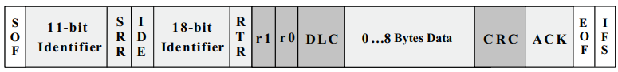
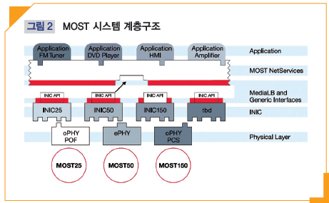

- [표준형 패킷과 확장형 패킷](#표준형-패킷과-확장형-패킷)
  - [패킷 구조](#패킷-구조)
    - [Standard CAN](#standard-can)
    - [Extended CAN](#extended-can)
- [Deeper into OBD-II](#deeper-into-obd-ii)
- [MOST 네트워크](#most-네트워크)
  - [MOST 시스템 계층 구조](#most-시스템-계층-구조)
  - [장점](#장점)
  - [기능 블록](#기능-블록)
  - [애플토크 설정](#애플토크-설정)
    - [MOST150이 가지는 3가지 매커니즘](#most150이-가지는-3가지-매커니즘)
      - [버스트 모드](#버스트-모드)
      - [항률](#항률)
      - [패킷 스트리밍](#패킷-스트리밍)

---

# 표준형 패킷과 확장형 패킷

## 패킷 구조

### Standard CAN

+ SOF(1 bit, Start of Frame)
  + marks start of a message
  + used to synchronize the nodes on a bus after being idle
+ RTR(Remote Transmission Request)
  + dominant when info is required from another node
  + all nodes receive request, identifier determines the specified node
  + responding data is received by all nodes, used by any node interested
  + all data being used in a system is uniform
+ IDE(Identifier Extension)
  + dominant single IDE means standard CAN identifier with no extension is being transmitted
+ r0: reserved bit
  + for possible use by future standard amendment
+ DLC(4-bit)
  + data length code
  + contains number of bytes of data being transmitted
+ Data(0~8 bytes)
+ CRC(16-bit, Cyclic Redundancy Check)
  + contains checksum(number of bits transmitted) of the preceding application data for error detection
+ ACK(Acknowledges, 2 bits)
  + one bit of acknowledgment, one bit of delimiter
  + indicates error-free message has been sent
+ EOF(End-of-Frame)
  + 7-bit field marks the end of a CAN frame and disables bit-suffering, indicating suffering error when dominant
+ IFS(7-bit, Interframe Space)
  + contains time required by the controller to move a correctly received frame to its proper position in a message buffer area

### Extended CAN

+ SRR(Substitute Remote Request)
  + placeholder in the extended format
+ IDE
  + recessive bit in IDE indicates more identifier bits follow(18-bit extension)
+ r1
  + additional reserve bit has been included ahead of DLC

+ [Introduction to the Controller Area Network (CAN)](https://www.ti.com/lit/an/sloa101b/sloa101b.pdf)
+ [Controller Area Network](https://www.eecs.umich.edu/courses/eecs461/doc/CAN_notes.pdf)

---

# Deeper into OBD-II

+ OBD: 차의 상태를 진단하고 결과를 알려주는 장치
+ 계측과 제어를 위해 탑재된 센서들을 ECU가 제어

+ OBD-I: 신뢰할 수 있는 배출가스 제어 시스템 만들기 위한 목적
+ OBD-II
  + 2005년부터 국내 모든 승용 자동차에 대해 시스템 장착이 의무화
  + 배출가스 관련 부품에 이상징후 &rarr; OBD-II 센서가 자동차의 ECU에 신호 전달 &rarr; ECU가 계기판에 엔진 체크등 들어오게 하여 배출가스 과다 배출을 사전 감지

# MOST 네트워크

+ [자동차용 멀티미디어 네트워크 MOST150 기술](http://webzine.koita.or.kr/201502-technology/Win-Win-Tech-%EC%9E%90%EB%8F%99%EC%B0%A8%EC%9A%A9-%EB%A9%80%ED%8B%B0%EB%AF%B8%EB%94%94%EC%96%B4-%EB%84%A4%ED%8A%B8%EC%9B%8C%ED%81%AC-MOST150-%EA%B8%B0%EC%88%A0)
+ Channels
  + Control Channel: for event-oriented transmission with low bandwidth(10 kBits/s) and short package length
  + Asynchronous Channel: packet oriented transmission with large block size and high bandwidth
  + Synchronous Channel: continuous data streams that require high bandwidth
+ Masters
  + Timing Master: controls timing of network and thereby the synchronization between the device
  + Network Master: sets up network & allocates addresses to devices
  + Connectoin Master: sets up synchronous communication channels between devices
  + Power Master: monitors power supplies, handles power up and shut down
+ A MOST device consists of 3 parts:
  + Physical interface
  + Network services
    + a Network Interface Controller(NIC) handles these services
    + Modern NIC have built in processor and are called INICs(Intelligent NICs)
    + Function Blocks(FBlocks)
      + take care of services that the device can supply
      + can have functions with 2 different targets:
        + application
        + MOST system(network)
      + Types
        + Controllers: controls one or more FBlocks
        + Slaves
          + FBlocks that are controlled by other FBlocks(Controllers)
          + knows nothing about the network
        + HMIs(Human Machine Interface)
          + used for interaction between user & device
      + Types of functions
        + Methods
          + functions that can be started and will lead to the result after certain period of time
        + Properties
          + functions that changes the status of device
        + Events
          + similar to properties but do not need external request
  + [MOST](http://www.cse.chalmers.se/~svenk/mikrodatorsystem/lectures/MOST_ppt.pdf)

## MOST 시스템 계층 구조

## 장점

+ 단순한 구조: 다양한 멀티미디어 기기를 링 구조의 단일 네트워크에 연결
+ 설계/유지 용이
+ 전선 중량(wiring harness) 감소: 2개의 선만 필요)광섬유, 파워 라인)
+ 확장성: 기기 및 장치의 확장 용이(링 토폴로지)
+ 최대 64개 장치 연결과 플러그앤플레이
+ 광대역: 대용량의 데이터를 고속 전송
+ 안정성, 신뢰성: 광을 이용하므로 EMI 감소/쇼트 문제가 없음
+ 오디오, 동영상, 데이터 패킷, 제어신호등 다양한 종류의 데이터를 동시에 전송

## 기능 블록

## 애플토크 설정

### MOST150이 가지는 3가지 매커니즘

#### 버스트 모드

#### 항률

#### 패킷 스트리밍