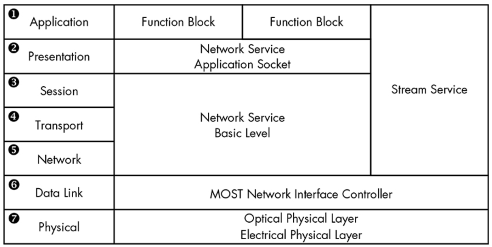
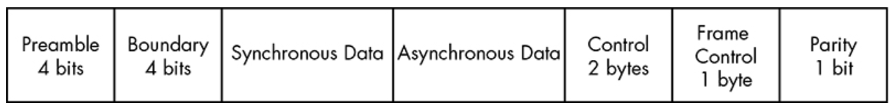
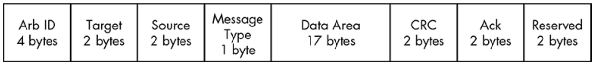

- [버스 프로토콜](#버스-프로토콜)
  - [CAN 버스](#can-버스)
  - [`OBD-II` 커넥터](#obd-ii-커넥터)
- [MOST 프로토콜](#most-프로토콜)
  - [MOST 네트워크 계층 구조](#most-네트워크-계층-구조)
  - [MOST 제어 블록](#most-제어-블록)

# 버스 프로토콜

+ 차량 내부 네트워크의 패킷 전송을 관리
+ 일부 네트워크와 백여 개 센서들이 이를 통해 통신
+ 정해진 시간에 메시지 전송해 차량 동작 제어와 차량 내 정보 전달
+ 제조사는 적합한 버스와 프로토콜 선택
  + OBD-2 커넥터에 연결되는 CAN 버스 프로토콜은 표준적임
  + 차량 CAN 버스에 전송되는 패킷들이 표준화되지 않음을 의미

+ 고속 버스 라인: RPM 관리, 브레이크 등
+ 중속/저속 버스 라인: 문 개폐, 에어컨 제어 등의 상대적으로 중요치 않은 통신

## CAN 버스

+ 제조업과 차량 산업에서 사용되는 단순한 프로토콜
+ CANH(high), CANL(low) 전선 사용해 버스 구성 (꼬임쌍선 twisted pair)
  + 차동 신호
    + 신호 발생 시 하나의 전선에서 전압 발생시키고 다른 하나는 동일 양만큼 전압 낮춤
    + 노이즈에 대한 고장 감내 체계가 갖춰진 환경에서 사용됨(Ex. 차량 시스템, 생산 시스템)
  + 센서와 ECU들은 송수신기를 갖고 있어 두 신호가 발생했는지 감지하고, CAN 신호라고 판단되지 않으면 노이즈로 판단해 무시
+ 버스의 양 종단 처리를 위해 120옴 종단 저항 연결해야 함
+ 종단 디바이스가 반드시 존재하지 않아도 됨
+ 기존 종단 디바이스를 CAN 버스 태핑(물리적 스니핑)을 위해 제거할 시 터미네이션 저항을 고려해야 함
+ 패킷 구성
  + `표준형 패킷`
    + ID: CAN 패킷이 브로드캐스팅 됐을 때 디바이스를 식별하는 ID가 작을수록 우선순위가 높은 패킷으로 판단(11bit)
    + Identifier Extension(IDE): 표준형 CAN에서 이 필드의 값은 항상 0
    + Data Length Code(DLC): 데이터 길이(0~8 바이트)
    + Data: 데이터가 저장되는 필드(~8바이트, 임의 변경해 확장하기도 함)
  + `확장형 패킷`
    + 표준형 패킷과 유사하나 패킷을 연결해 더 긴 ID 사용 가능(18bit)
    + 표준형 패킷과 호환성 유지하도록 설계
    + 플래그에서 표준형 패킷과 차이
      + 표준형 패킷의 `RTR`(Remote Transmission Request) 대신 `SRR`(Substitute Remote Request) 사용하고 이 값이 1로 설정됨
      + IDE 패킷 값이 1
  + 동일 네트워크 상 CAN 패킷을 모두 볼 수 있어 누가 어떤 내용의 패킷을 전송했는지 패킷 내에 저장해 전송할 필요가 없음
  + 특정 제어기인 척 가짜 패킷을 전송하기 쉬움

## `OBD-II` 커넥터

+ 차량 내부 네트워크와 통신
+ 조향 핸들 아래 주변과 대시보드 주변에 위치
+ 이에 모든 버스가 연결되어 있는 건 아님

# MOST 프로토콜

: Media Oriented Systems Transport

+ 멀티미디어 디바이스를 위해 설계
+ 최대 64개 디바이스 연결 지원
+ 원형/방사형의 버스 구조로 구현
+ 23Mbaud로 동작, 15개 내의 비압축 CD 품질 오디오 또는 MPEG1 오디오/비디오 채널 지원
  + 각 제어 채널들은 768Kbaud 속도로 동작하고 MOST 디바이스들로 설정 메세지 전송
+ 속도로 구분
+ |MOST, MOST25|MOST50|MOST150|
  |---|---|---|
  |플라스틱 광섬유에서 동작, 데이터는 붉은색 빛 파장을 650nm 속도로 LED를 통해 송수신|광섬유 대신 UTP 케이블로 데이터 전송|이더넷을 통해 전송, 프레임은 3072비트 길이에 150Mbps 속도|
+ MOST 프레임이 갖는 3가지 프레임
  + 동기식(Synchronous): 스트리밍 데이터(오디오/비디오)
  + 비동기식(Asynchronous): 분산된 패킷 형태의 데이터(TCP/IP)
  + 제어(Control): 제어와 저속 데이터 전송(HMI)
+ 타이밍 마스터
  + 마스터는 플러그앤플레이와 같은 기능을 허용하는 각 디바이스에 주소 자동 할당
+ 다른 버스들과 달리 입출력 포트를 분리해 패킷 경로 설정

## MOST 네트워크 계층 구조

## MOST 제어 블록

+ MOST25에서 한 블록은 16개 프레임으로 구성
  + 프레임은 512비트
  + | 프리앰블 4비트 | 경계 4비트 | 동기 데이터 | 비동기 데이터 | 제어 2바이트 | 프레임 제어 1바이트 | 패리티 1비트 |
    + 
  + 동기식 데이터는 6~15`쿼들렛`(1 쿼들렛은 4바이트), 비동기식 데이터는 0~9쿼들렛 포함
  + 제어프레임은 2바이트지만 전체 블록/16프레임이 조합되면 총 32바이트 제어 데이터가 됨
  + 조합된 제어 블록: | Arb ID 4바이트 | 목적지 2바이트 | 출발지 2바이트 | 메시지 타입 1바이트 | 데이터 영역 17바이트 | CRC 2바이트 | Ack 2바이트 | 예약됨 2바이트 |
    + 
    + 데이터 영역
      + FblockID
        + 핵심요소의 ID 또는 `기능 블록`을 나타냄
          + Ex. FblockID=0x52 &rarr; 해당 기능은 내비게이션 시스템을 의미
      + InstID
        + 기능 블록의 인스턴스 나타냄
        + CD 체인저들 중 어떤 체인저가 동작하는지 식별
      + FktID
        + 높은 수준의 기능 블록들을 조회하는 데 사용
        + Ex. FktID=0x0 &rarr; 기능 블록에 의해 제공되는 모든 Function ID의 목록이 조회됨
      + OP 타입
        + 기능의 종류
        + get, set, increment, decrement, ...
      + Tel ID & Len
        + 통신의 종류와 길이
        + 통신 종류: 단일 전송, 멀티패킷 전송, 통신의 길이에 대한 정보
+ MOST50
  + MOST25와 유사하지만 더 큰 데이터 영역 가짐
+ MOST150
  + 두 개의 추가 채널 가짐
    + 이더넷
      + 일반적인 TCP/IP와 `애플토크 설정`처럼 동작
    + 동시성 이더넷
      + `버스트 모드`, `항률`, `패킷 스트리밍`이라는 세 가지 매커니즘 가짐