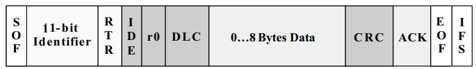

- [표준형 패킷과 확장형 패킷](#표준형-패킷과-확장형-패킷)
  - [패킷 구조](#패킷-구조)
    - [Standard CAN](#standard-can)
    - [Extended CAN](#extended-can)
- [Deeper into OBD-II](#deeper-into-obd-ii)

---

# 표준형 패킷과 확장형 패킷

## 패킷 구조

### Standard CAN

+ SOF(1 bit, Start of Frame)
  + marks start of a message
  + used to synchronize the nodes on a bus after being idle
+ RTR(Remote Transmission Request)
  + dominant when info is required from another node
  + all nodes receive request, identifier determines the specified node
  + responding data is received by all nodes, used by any node interested
  + all data being used in a system is uniform
+ IDE(Identifier Extension)
  + dominant single IDE means standard CAN identifier with no extension is beign transmitted
+ r0: reserved bit
  + for possible use by future standard amendment
+ DLC(4-bit)
  + data length code
  + contains number of bytes of data being transmitted
+ Data(0~8 bytes)
+ CRC(16-bit, Cyclic Redundancy Check)
  + contains checksum(number of bits transmitted) of the preceding application data for error detection
+ ACK(Acknowledges, 2 bits)
  + one bit of acknowledgment, one bit of delimiter
  + indicates error-free message has been sent
+ EOF(End-of-Frame)
  + 7-bit field marks the end of a CAN frame and disables bit-suffering, indicating suffering error when dominant
+ IFS(7-bit, Interframe Space)
  + contains time required by the controller to move a correctly received frame to its proper position in a message buffer area

### Extended CAN

+ SRR(Substitute Remote Request)
  + placeholder in the extended format
+ IDE
  + recessive bit in IDE indicates more identifier bits follow(18-bit extension)
+ r1
  + additional reserve bit has been included ahead of DLC

**RTR**

**SRR**

+ [Introduction to the Controller Area Network (CAN)](https://www.ti.com/lit/an/sloa101b/sloa101b.pdf)

---

# Deeper into OBD-II

+ OBD: 차의 상태를 진단하고 결과를 알려주는 장치
+ 계측과 제어를 위해 탑재된 센서들을 ECU가 제어

+ OBD-I: 신뢰할 수 있는 배출가스 제어 시스템 만들기 위한 목적
+ OBD-II
  + 2005년부터 국내 모든 승용 자동차에 대해 시스템 장착이 의무화
  + 배출가스 관련 부품에 이상징후 &rarr; OBD-II 센서가 자동차의 ECU에 신호 전달 &rarr; ECU가 계기판에 엔진 체크등 들어오게 하여 배출가스 과다 배출을 사전 감지